# Community Platform
The main objective of this website is to provide a single platform for communication between students and faculty, students and administration, students and alumni, and also among students. 

* Community Platform eliminates the need for various social media platforms by providing a single platform which allows students, faculty and administration to interact with each other.​

* Users can view all college related announcements. ​

* Circulars and other related information are available branch wise.​

* Students can post questions as well as answer them in the discussion forums .​

* Information related to future opportunities and career guidance can be shared with all the users.​
#### Images
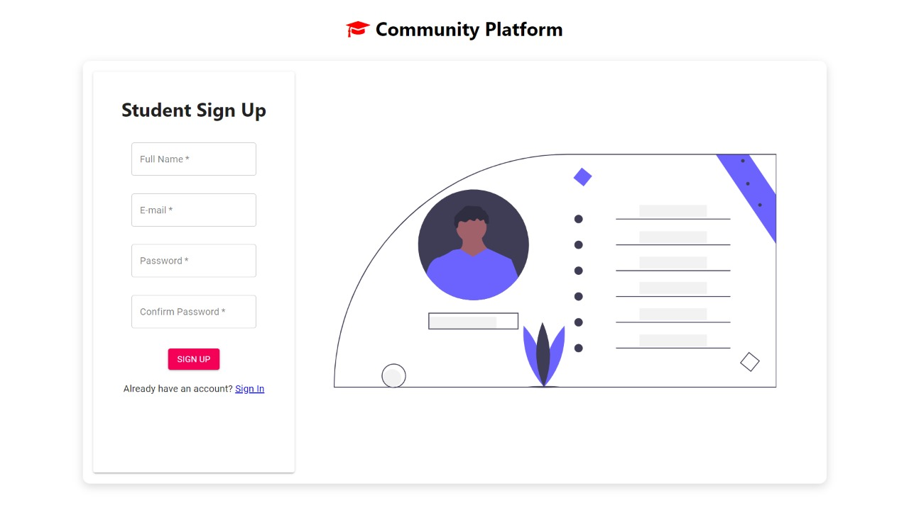
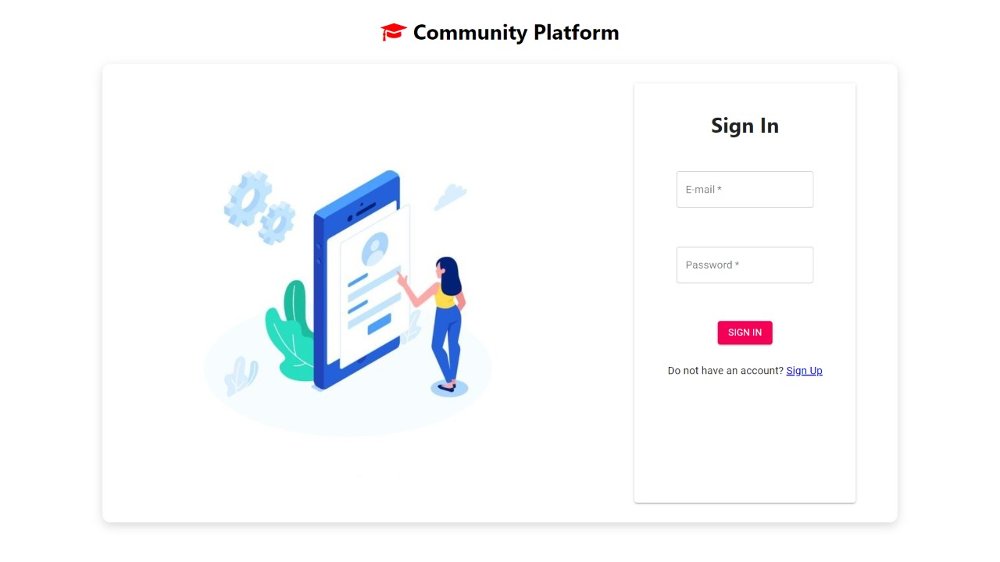
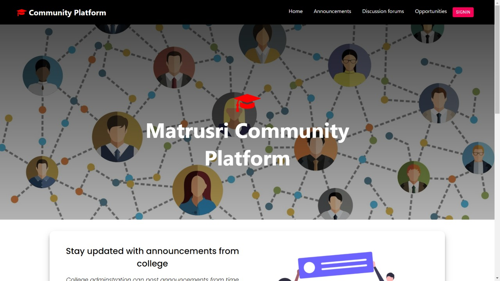
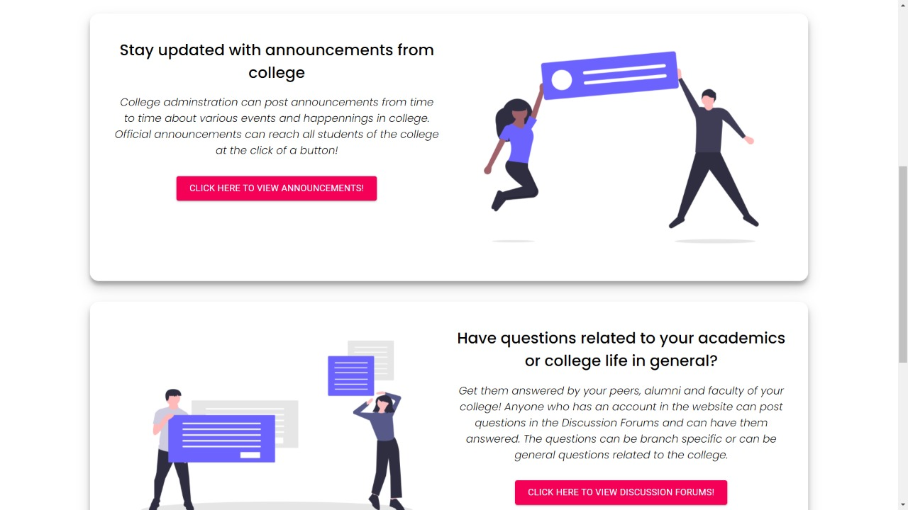
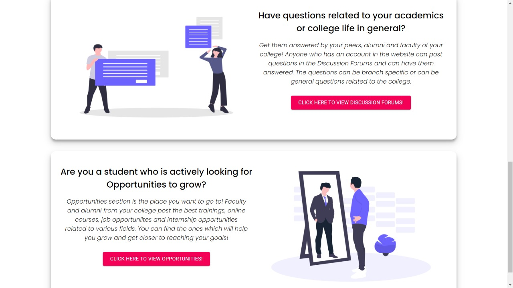
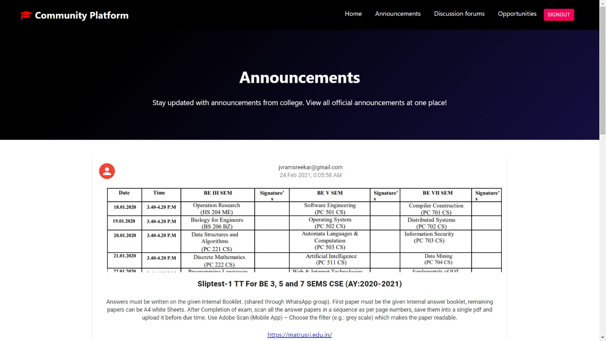
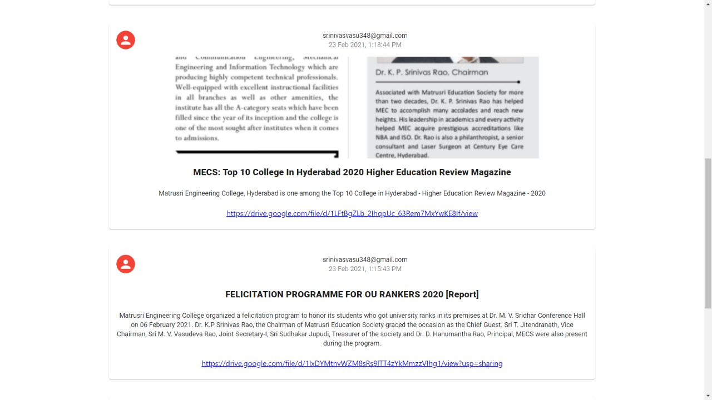
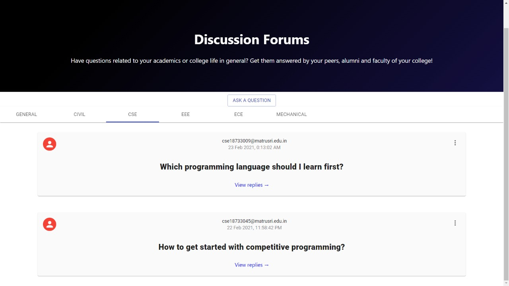
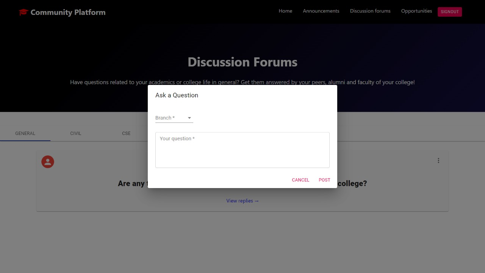
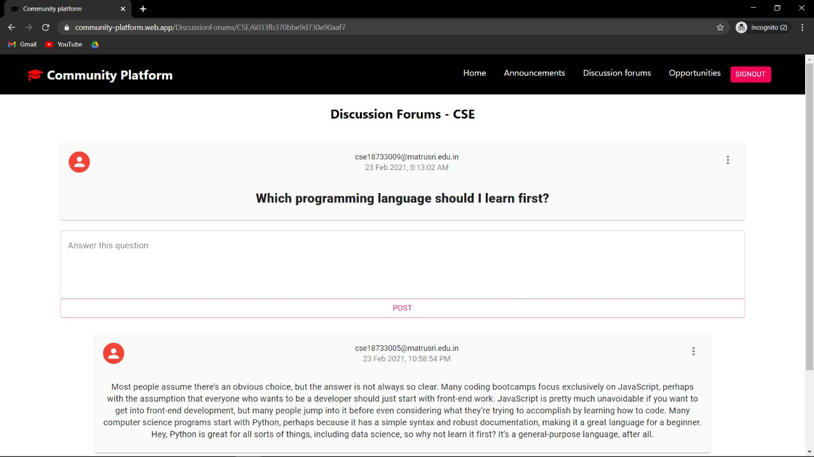
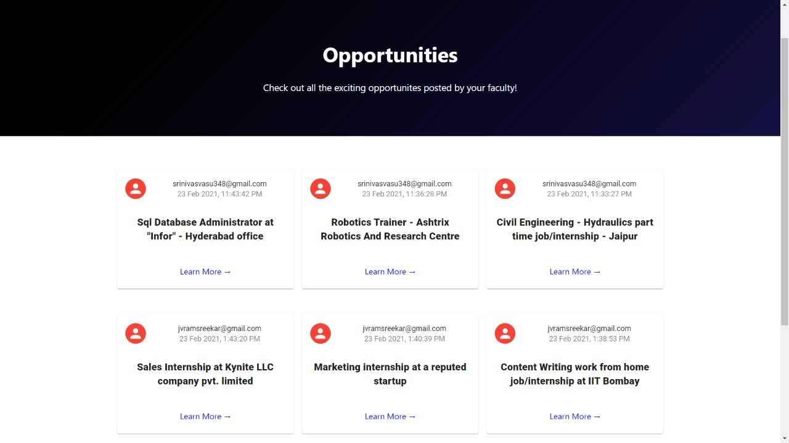
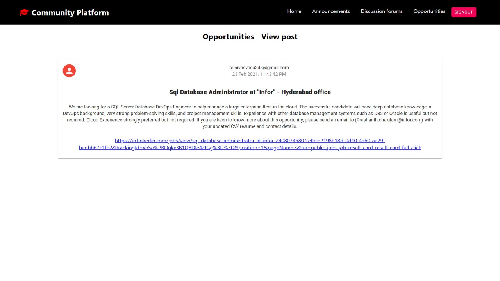
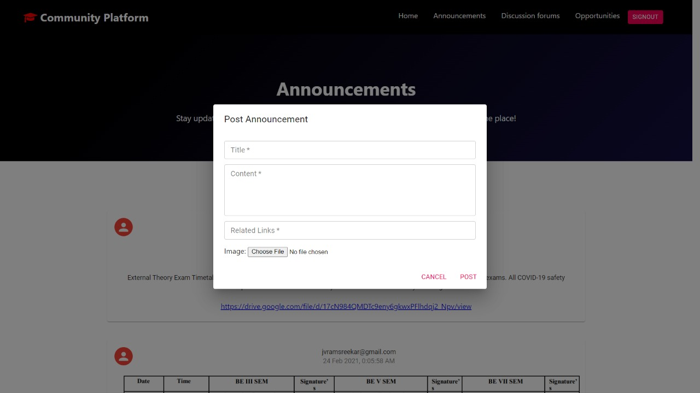
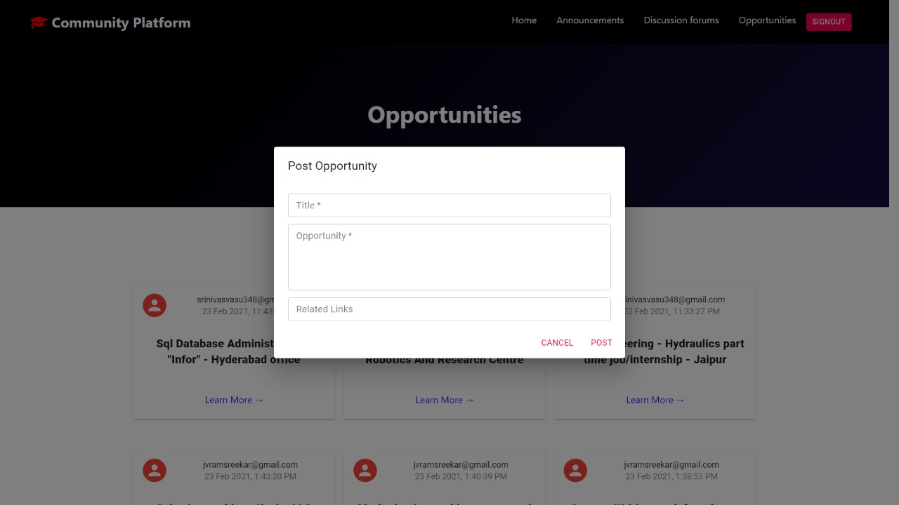

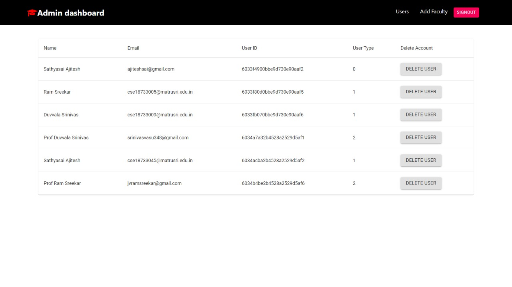
